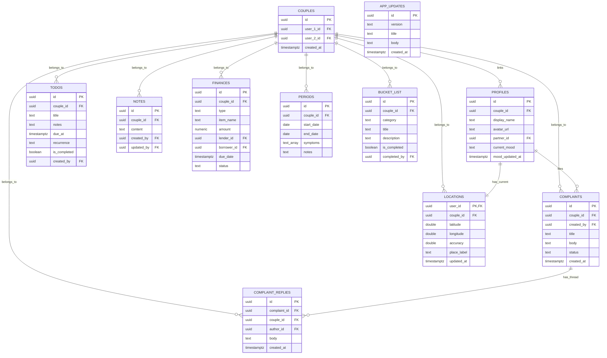

# NOVIA - High-Fidelity Couple's Hub

[](https://expo.dev/)
[](https://reactnative.dev/)
[](https://supabase.com/)
[](https://www.typescriptlang.org/)

**NOVIA** is a premium, real-time synchronized couple's hub application built with **Expo**, **React Native**, and **Supabase**. It is designed with a striking, atmospheric space-inspired theme (neon orange glows and tactical visual grain filters) to deliver an engaging, smooth, and hyper-personalized co-presence experience.

Whether it's raising a complaint ticket, keeping a shared todo list, learning a new word each day, tracking menstrual health cycles, sharing notes and brainstorms, managing mutual finances, logging medical metrics, or checking off bucket list adventures, **NOVIA** keeps you and your partner perfectly aligned.

---

## Features walkthrough

### 1. Complaint Box, Shared Todos & Daily Vocabulary
*  **Complaint Box (ticketing)**: Either partner can file a complaint with a title and description. The other partner can reply in a thread, and the ticket can be marked resolved or reopened — new complaints and replies trigger a notification for the other partner.
*  **Shared Todo List**: Couple-scoped todos with a chosen reminder time and `once` / `weekly` / `monthly` / `yearly` recurrence. Because the list is shared and each device schedules from it, **both partners are reminded** via a local notification.
*  **Word of the Day**: A bundled, offline vocabulary deck surfaces a new word + meaning every day (identical for both partners) as a Hub card and a daily notification.
*  **Icon navigation**: A lean icon bottom bar (Hub · Notes · Finances · Health) with Todo, Complaint Box, Bucket List, and Location reachable as Hub cards.

### 2. Predictive Cycle & Menstrual Tracker
*  **Smart Cycle Mathematics**: Uses historical start and end dates to calculate a running average of cycle length (sanitized for realistic 15-45 day ranges) and predict the next period, fertile window, and peak ovulation days.
*  **Dynamic Visual Phases**: Real-time indication of current menstrual phase: *Menstruation, Follicular, Ovulation,* or *Luteal*.
*  **Intimate Questionnaire**: An intimate GF Menstrual Prediction questionnaire assessing bleeding levels, physical changes (cramps, bloating), fluids, and emotional/energy patterns.
*  **Automated Partner Warnings**: Schedules silent reminders one day in advance for both partners to foster mutual support and care.

### 3. Real-Time Co-Presence & Shared Notes
*  **Partner Typing Indicators**: Real-time channel integration shows when your partner is active and typing a note.
*  **Live Markdown Notes**: Shared whiteboard style digital note cards, updating instantly across devices as soon as anyone saves changes.

### 4. Joint Finance Manager
*  **Subscriptions, Borrowings, & Self-Liabilities**: Categorized ledger showing who owes whom, amount, due date, and renewal cycle.
*  **Overdue & Alert System**: Flags overdue payments instantly and schedules system notifications for both partners 24 hours prior to due dates.

### 5. Medical Record Vault
*  **Blood Pressure & Blood Sugar Monitors**: Specialized validation algorithms (`validateBloodPressure`, `validateBloodSugar`) warning users of out-of-range systolic/diastolic or glucose readings.
*  **Hospital Visit Tracker**: Historical record of visits, reasons, medical outcomes, and attachments securely referenced via Supabase.

### 6. Shared Couple's Bucket List
*  **Categorized Dreams**: Travel, fine dining, adventure, and learning tabs.
*  **Interactive Micro-Animations**: Features custom animated rows with blinking visual feedback when items are marked completed.

### 7. Offline First-Aid Guide
*  **Quick Search**: Fully offline search engine with a curated list of emergency medical guidelines (e.g., choking, burns, fractures, CPR).

### 8. Real-Time Location Sharing
*  **Live Co-Presence Maps**: Share your exact coordinates, accuracy, and reverse-geocoded place labels with your partner seamlessly.
*  **Opt-In Privacy**: Strict row-level security limits access to your partner only, ensuring total privacy.

### 9. Over-The-Air (OTA) Updates & In-App Changelog
*  **Seamless Delivery**: Automatically fetches and applies the latest app JS features and bug fixes without needing to download a new APK or wait for app store approvals.
*  **What's New page**: A hand-authored, global changelog (the `app_updates` table) shown under **Settings → What's New**. Both partners see the same list, and a new entry fires an "update available" notification with its title as the reasoning. See [docs/UPDATES.md](docs/UPDATES.md) for how to publish an entry via the Supabase SQL editor.

---

## Technology Stack

*  **Framework**: Expo (SDK 54) & React Native CLI (TypeScript based)
*  **Database & Sync**: Supabase (PostgreSQL with Realtime WebSockets, row-level security, and triggers)
*  **Styling & UI**: Vanilla React Native StyleSheet with high-fidelity `react-native-svg` atmospheric shaders and a custom fractal grain noise filter overlay
*  **Local Storage**: `@react-native-async-storage/async-storage`
*  **Icons**: `lucide-react-native`
*  **Notification Engine**: `expo-notifications` for scheduled todo reminders, the daily vocabulary word, and update alerts

---

## Database Architecture

The backend database runs on **Supabase (Postgres)**. Below is a visual representation of how the tables interact under Row Level Security (RLS) policies:



> `APP_UPDATES` is a global (non-couple-scoped) changelog table readable by every authenticated user.

### Row-Level Security (RLS) & Multi-Tenancy
All data is secured at the database layer using Postgres RLS policies. 

1. **Couple-scoped security**: The database provides a secure helper function `public.get_couple_id()` that extracts the current active couple partition:
  ```sql
  CREATE OR REPLACE FUNCTION public.get_couple_id()
  RETURNS UUID AS $$
    SELECT couple_id FROM public.profiles WHERE id = auth.uid();
  $$ LANGUAGE sql SECURITY DEFINER;
  ```
2. **Access Policies**: The shared tables (Notes, Complaints, Todos, Finances, Periods, Bucket List) restrict read/write access to only users matching the partner couple ID:
  ```sql
  CREATE POLICY "Allow access to couple todos"
    ON public.todos FOR ALL
    USING (couple_id = public.get_couple_id());
  ```
3. **Automatic Profile Creation Trigger**: An auth trigger is installed so that whenever a user signs up through Supabase Auth, a corresponding row in the public `profiles` table is automatically provisioned:
  ```sql
  CREATE OR REPLACE TRIGGER on_auth_user_created
    AFTER INSERT ON auth.users
    FOR EACH ROW EXECUTE FUNCTION public.handle_new_user();
  ```

---

## Setup & Installation

### Prerequisites
*  [Node.js](https://nodejs.org/) (v18+ recommended)
*  [Git](https://git-scm.com/)
*  A [Supabase](https://supabase.com/) account and project.

### 1. Clone & Install Dependencies
```bash
git clone https://github.com/Adarsh-Aravind/NOVIA.git
cd NOVIA
npm install
```

### 2. Environment Configuration
Create a `.env` file in the root directory and add your Supabase credentials. Use `.env.example` as a reference:
```env
EXPO_PUBLIC_SUPABASE_URL=https://your-project-id.supabase.co
EXPO_PUBLIC_SUPABASE_ANON_KEY=your-supabase-anonymous-key
```

### 3. Database Migration (Supabase)
1. Go to your **Supabase Dashboard** -> **SQL Editor**.
2. For a fresh project, paste and **Run** the contents of `schema.sql` (root of this project) to initialize all tables, RLS policies, helper functions, auth triggers, and indexes.
3. For an existing 2.0 install upgrading to 2.1, instead run `supabase/migrations/20260705_complaints_todos_updates.sql`, which drops the retired alarm tables and creates `complaints`, `complaint_replies`, `todos`, and `app_updates`.
4. To publish changelog entries for the in-app **What's New** page, see [docs/UPDATES.md](docs/UPDATES.md).

### 4. Run Locally
Start the Expo development server:
```bash
npm run start
```
*  Press `a` to run on an Android emulator or connected device.
*  Press `i` to run on an iOS simulator.
*  Scan the QR code with the **Expo Go** app (Android) or Camera app (iOS) to test on a physical device.

---

## Codebase Directory Structure

```
├── .expo/               # Expo cache and system configuration
├── assets/              # Static media resources and adaptive icons
├── docs/                # Author guides (e.g., UPDATES.md — publishing changelog entries)
├── supabase/            # SQL migrations (incl. the 2.1 complaints/todos/updates migration)
├── src/
│   ├── constants/       # App themes, offline first-aid data, and the vocabulary deck
│   ├── hooks/           # Custom React hooks (location, notes, todos, complaints, period cycle math)
│   ├── services/        # Services for notifications, location tracking, OTA/updates, and Supabase
│   ├── types/           # Core TypeScript type definitions and interfaces
│   └── utils/           # Helper calculations, blood pressure/sugar validators, and debouncers
├── App.tsx              # Core app component housing all navigations, states, and tab views
├── app.json             # Expo native app manifestation configurations
├── eas.json             # Expo Application Services configuration for cloud builds
├── schema.sql           # Complete SQL script for database setup on Supabase
└── tsconfig.json        # TypeScript compiler configurations
```

---

## Contributing & Authors

*  **Developer/Author**: Adarsh Aravind
*  **GitHub**: [@Adarsh-Aravind](https://github.com/Adarsh-Aravind)

Feel free to fork this project, submit issue reports, or open pull requests to expand NOVIA's features!
